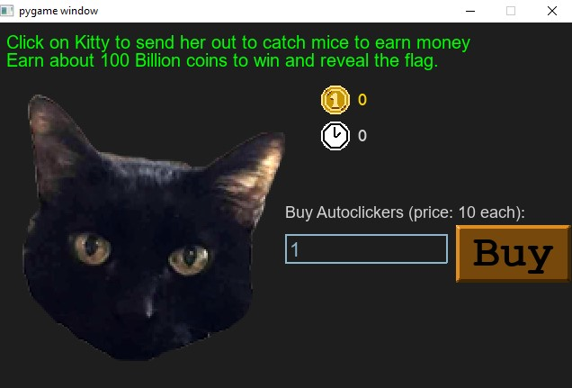

# Fiddler
When you run the exectuable, you are show the prompt below asking for the password. This can be found by looking at the source code provided.

If you notice in this image, the image blow, it runs code against the altered_key variable which appears to be what the input is being checked against. 

The code for key looks to be subtracting one from the ascii decimal value which means it shifts the alphabet down one. h becomes g... and so on. This is an attempt to obfuscate the actual key in code and is the equivelant of a basic shift cipher.

So to find out what this value is, you can execute the code for key inside an interpreter and see what the output of key will be.

Enter 'ghost' in password prompt. 

The next screen requires that you buy coins. The way to get coins is the click on the cats head. 

The program references an auto clicker but they mention it requires something close to 100 billion coins (or clicks) to reveal the flag. This is unrealistic even if you automate with a python automation library. I was curious how many clicks you can send with python but, as you can imagine, this didn't work out well so you can avoid that method.

Because they provide the source code (although you could decompile the python executable), you can look for parts of the code that directs execution to win the game or reveal the flag. In this case, if you wanted to use the program to do the work for you, you can add a line to the source in order to preset the coin amount right before the program checks for the value. The image below shows where this is done. 

Following this, make sure you install the pygame library using pip and then you should be able to execute the code using the source. Now that we are editing source, you can also update the input value to be the proper key for the password, or simply type in ghost again.  

