# Garbage
The only message provided with this challenge and executable is the following:


Message.txt
```
One of our team members developed a Flare-On challenge but accidentally deleted it. 
We recovered it using extreme digital forensic techniques but it seems to be corrupted. 
We would fix it but we are too busy solving today's most important information security threats affecting our global economy. 
You should be able to get it working again, reverse engineer it, and acquire the flag.

```

So there are a few things here based on this message and a lot of rabbit holes to go down if you are not familiar with PE files. This was my situation and in the end the solution seems relatively simple but to get to that point definitely took some time. I will spare some of the details but it involed a lot of trial and error doing what I thought was the right path, investigating why it failed, and not having great resolution because nothing really accounts for corrupted files when googling. It's only after googling fails that you have to assume it's a different issue or you are not on the right path.


Okay so there are a few steps you can take in any order but I'll try to do the most logical method.

1. Import the corrupted executable into a tool like cff explorer. This is where I did the majority of editing but other honorable mentions for tools that helped with this challenge are PE-bear and HxD. 

2. CFF Explorer will tell you a lot of things. If you look at sections headers, you can see that there is UPX for two of the headers. This tells us it was a packed executable packed with UPX. If you want to know about what packing is, I suggest googling packers in relation to malware.
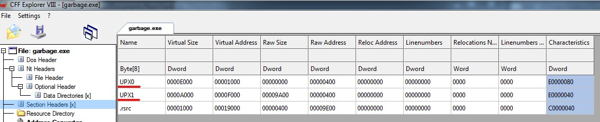

3. The logical thing to do at this point is to try to use CFF Explorer to unpack it. If you do this, you will likely see an error.

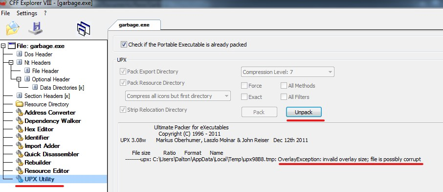

4. You may choose to open HxD and determine what is in the file and what is missing. There are a few indicators there that help us later on but for now I would recommend sticking with CFF Explorer. In both cases, the method that helps the best is comparing a non-corrupted executable with the corruped one to help demonstrate what is missing. 

In this case, we are missing the import directory, or the Import Address Table, among other things. There only way to know we are missing this is to look at a non-corrupted executable in CFF Explorer.

Non-Corrupted
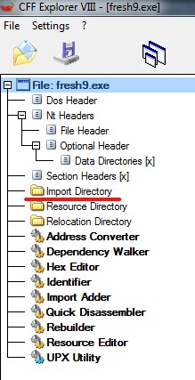

Corrupt
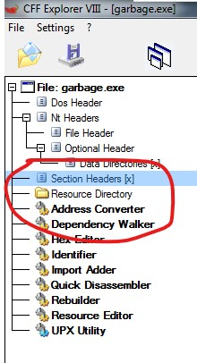

5. Okay so we are missing the IAT. Let's try to rebuild it. You can use CFF for this but in my experience it will add this to the end of the file so you first need to have enough bytes at the end. It also helps to get things aligned. So we can used HXD to add null bytes and PE-Bear to fix the alignment. There's videos on this as well as I can't demo this enough in markdown. After adding null bytes to the end, PE-Bear headers show we're good to go and the raw address match the sizes with whats in HxD. Sometimes they will need adjusting. 


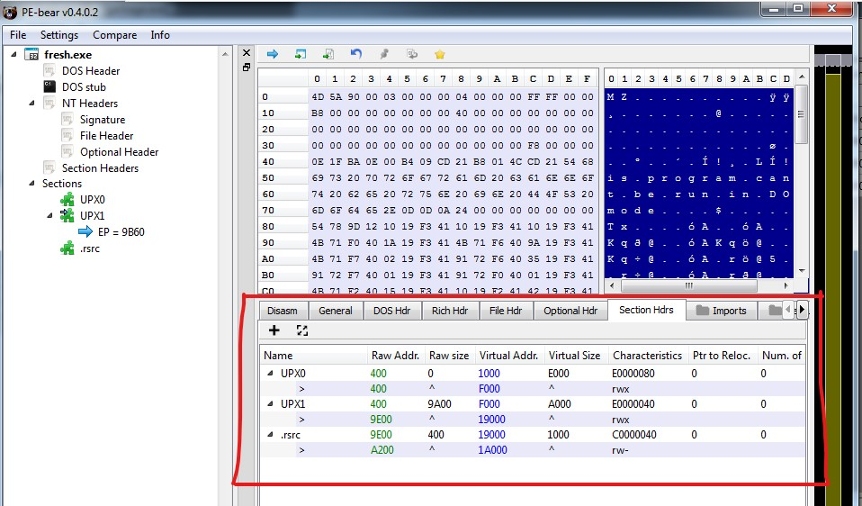

6. Okay great, now use CFF Explorer to add a new import table. I added the module Kernel32.dll with common dlls. I'm not sure so much that this mattered, in the end they get overwritten. There are also videos on this, unfortunately I'm not going to describe this process in markdown. For this challenge use module Windows/Syswow64/Kernel32.dll. This part of the tools is a bit of a pain but it gets the job done well.


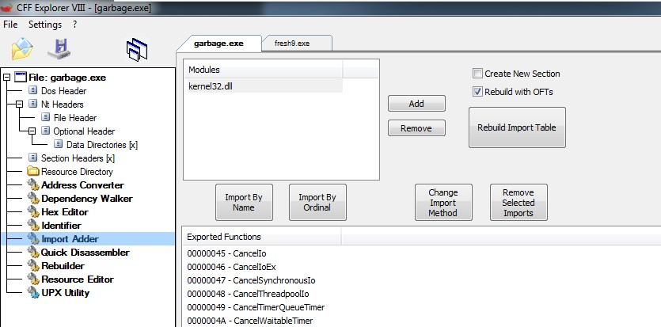


7. Okay once this is done and if successful, you should be able to unpack it now using CFF Explorer's UPX Utility. 

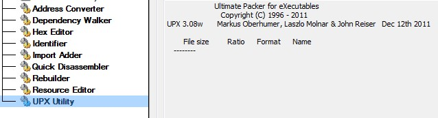

8. After this is done, you may want to execute, check out the headers again, do whatever to try to validate a valid PE file. It won't execute so after scoping it out, the best plan here is to update the resources, again with CFF explorer. This is related to the manifest in the PE file which you may have noticed is missing some data compared to valid PEs. Do not try to add the bytes in HxD for a valid manifest, this resulted in hours of trial and error and unless you know the proper formatting and size needed, it's much easier to use CFF explorer. 


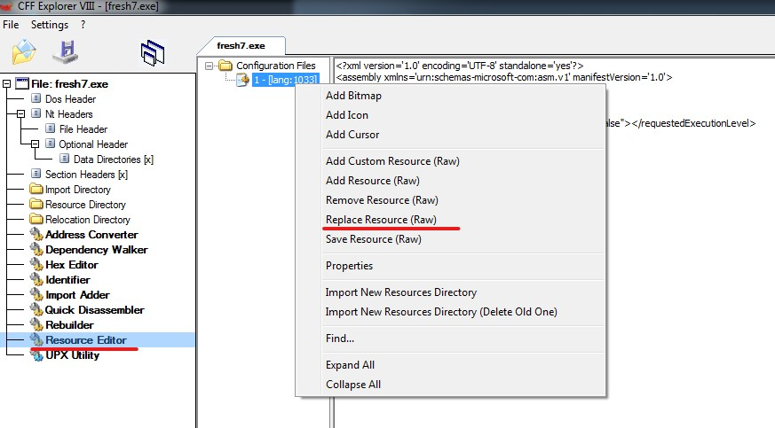

9. So the last step here is maybe try to run it. You will then get some weird errors about loading dlls. 


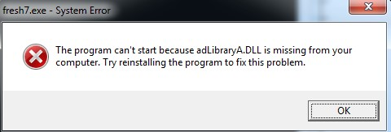

10. Now you can open in CFF one more time and take a look at the import directory where our imports for dlls are. Based on the functions list, such as "GetCurrentProcess", and maybe some googling, you can determine you need to update the module names to Kernel32.dll and Shell32.dll. This part just requires that you know what those modules names should be or look them up on google. Once those names are updated, the file should look like this:

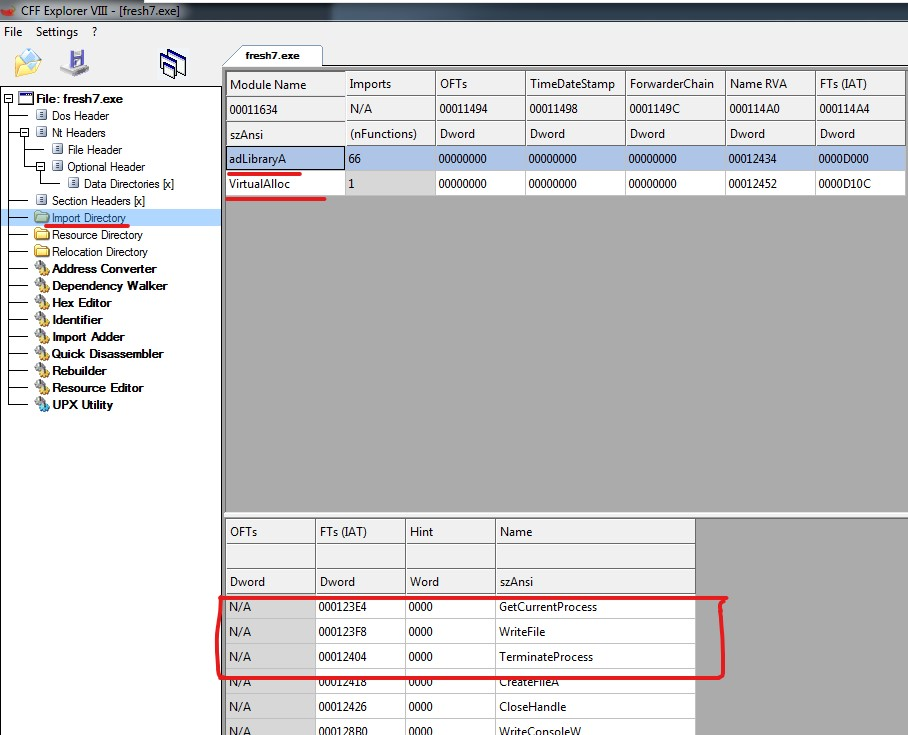

11. Alright those are the steps. Not sure if it's helpful to describe it this way but these are the steps I did. Hopefully the program runs now and this should be the result:


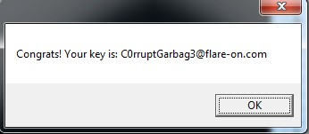


I'm also told these steps could be minimized althought I haven't read any write ups to confirm this yet. 


