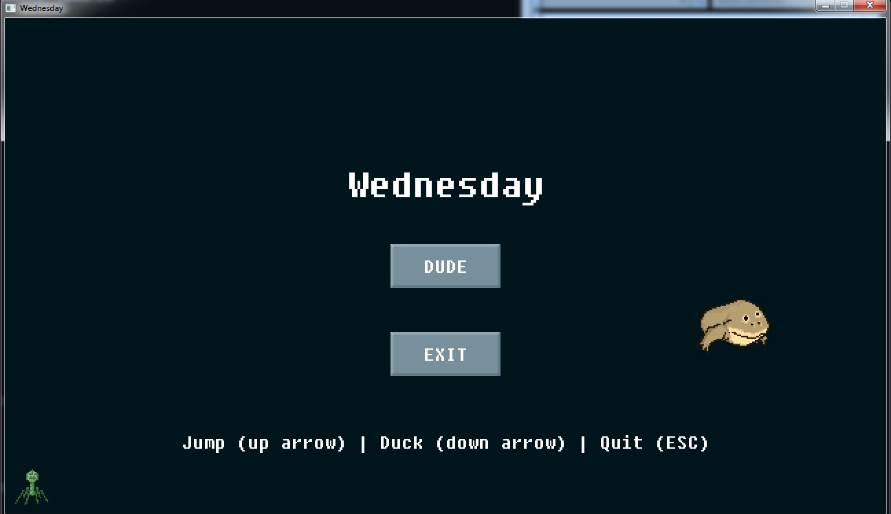

# Wednesday

After installing a sound card on vm and enabling accelerated graphics, you will see a type of game playing some pretty cool 8-bit music.

You can play the game but it's not clear what the goal of the game is. After opening in a debugger to determine this, it appears that all the symbol information is available so this should making reverse the program a lot easier, in theory.